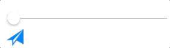
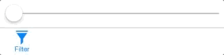

# DYBadgeButton

[](https://travis-ci.org/dominikbutz/DYBadgeButton)
[](http://cocoapods.org/pods/DYBadgeButton)
[](http://cocoapods.org/pods/DYBadgeButton)
[](http://cocoapods.org/pods/DYBadgeButton)
[](https://github.com/Carthage/Carthage)


 DYBadgeButton (written in Swift 4) features a UIButton with a pop up badge. If the string value of the badge changes from nil (or "nullish") to a valid string value at runtime the badge will appear with a pop up effect. If it switches back to a "nullish" value, it will shrink and disappear.
The class also includes a class function to create a button with an image and a title, which is positioned underneath the image. 

## Example

To checkout the example project, simply clone the repo or download the zip file. 

## Features

* Customise the badge text color, badge color and badge font.
* Set x and y offset to move the badge to a customised position
* Create a DYBadgeButton with image and a button title placed underneath the image

## Installation

Because of some parsing problem, installation through cocoapods might currently not work.  

Therefore installation through Carthage is recommended. Simply add the following line to your Cartfile:
github "DominikButz/DYBadgeButton" ~> 0.3.7

Replace the version number with the shown in the header above. 

Afterwards, run "carthage update DYBadgeButton --platform iOS" in the root directory of your project. Follow the steps described in the carthage project on github (click on the carthage compatible shield above). 

Make sure to import DYBadgeButton into your View Controller subclass:

```Swift
import DYBadgeButton
```

## Usage

Check out the following examples.

### Code example: Creating a DYBadgeButton from Interface Builder


```Swift
 @IBOutlet weak var firstButton: DYBadgeButton!  // simply drop a UIButton into the VC from interface builder in storyboard  and set the class to DYBadgeButton
 

 override func viewDidLoad() {
   super.viewDidLoad()
   
   // you can override the font, text color and badge color like so
   
   self.firstButton.badgeFont = UIFont(name: "Helvetica Neue", size: 11.0)!
   self.firstButton.badgeColor = self.view.tintColor
   self.firstButton.badgeTextColor = UIColor.black
   
   // set a start value if required
   self.firstButton.badgeString = "7"
   
 }

```

 

### Code example: Creating a DYBadgeButton with image and title

 
```Swift

 @IBOutlet weak var secondButtonItem: UIBarButtonItem!

 override func viewDidLoad() {
	    super.viewDidLoad()
	        
		let frame =  CGRect(x: 0, y: 0, width: 25.0, height: 26.0)
		let font = UIFont(name: "Helvetica Neue", size: 11.0)!
		let color = self.view.tintColor
		let filterButton  = DYBadgeButton.createDYImageTitleButton(image:  imageLiteral(resourceName: "filterButton"), title: "Filter", font: font, frame: frame, tintColor: color!)
		filterButton.badgeColor = color!
		// set xOffset and yOffset to move the position of the badge. Because of the frame modification, the badge might be misplaced otherwise. 
		filterButton.xOffset = -15.0
		filterButton.yOffset = -5.0
		self.secondButtonItem.customView = filterButton
	}
```
 

## Change log
#### [Version 0.3.7](https://github.com/DominikButz/DYBadgeButton/releases/tag/0.3.7)
Framework Build phase corrections.
#### [Version 0.3.5](https://github.com/DominikButz/DYBadgeButton/releases/tag/0.3.5)
correting header umbrella file
#### [Version 0.3.4](https://github.com/DominikButz/DYBadgeButton/releases/tag/0.3.4)
corrections in Podspecs file
#### [Version 0.3.3](https://github.com/DominikButz/DYBadgeButton/releases/tag/0.3.3)
Adding header file
#### [Version 0.3.2](https://github.com/DominikButz/DYBadgeButton/releases/tag/0.3.2)
Bug fix.

#### [Version 0.3.1](https://github.com/DominikButz/DYBadgeButton/releases/tag/0.3.1)
Adding animation for frame change of the badge label.

## Author

dominikbutz@gmail.com

## License

DYBadgeButton is available under the MIT license. See the LICENSE file for more info.


